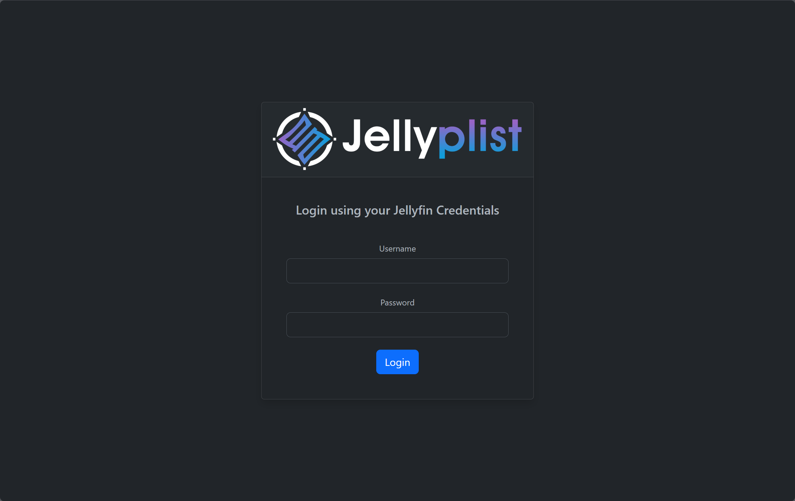
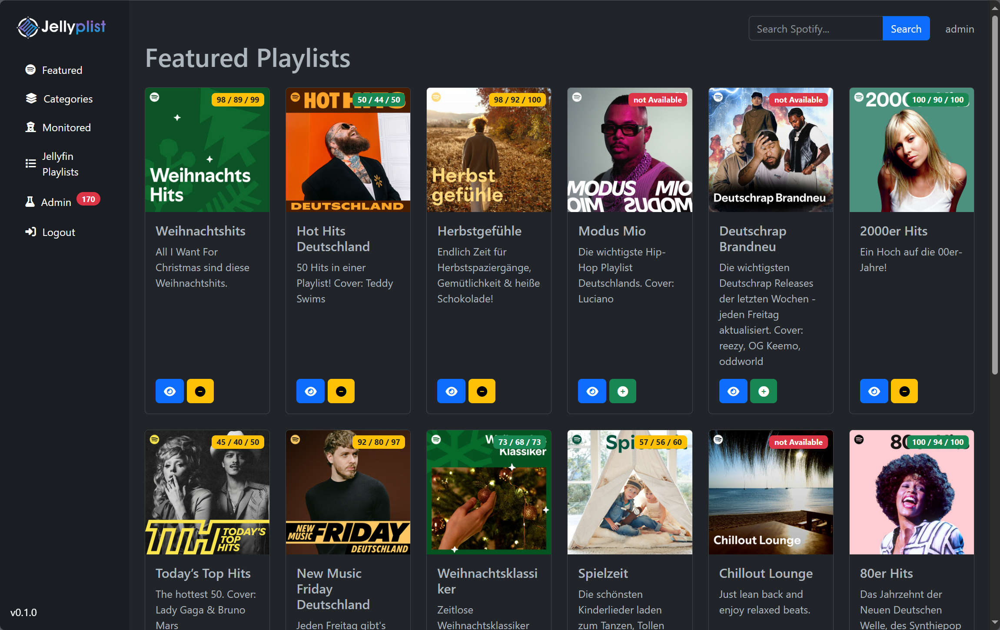
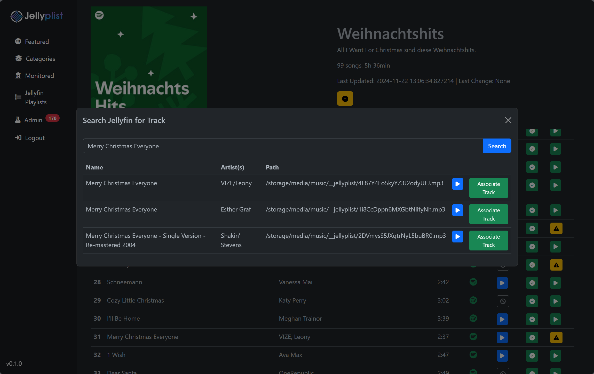
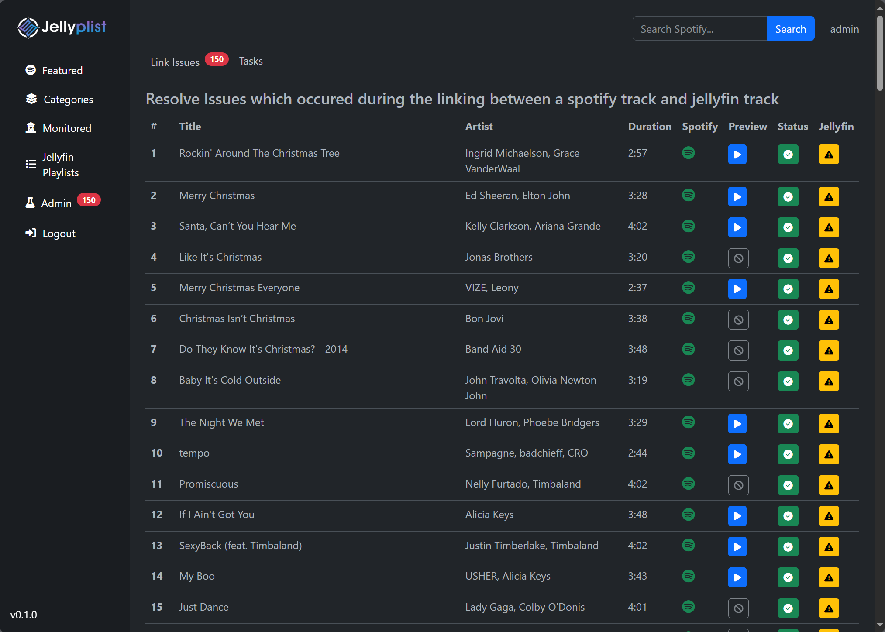

> [!WARNING]  
> Jellyplist is still at a very early stage: expect Bugs and weird behaviour. Especially the UI and UX are a bit clunky and unresponsive

## What is Jellyplist ? 
Jellyplist aims to be a companion app for your self-hosted [Jellyfin](https://jellyfin.org/) Server. With Jellyplist you will be able to replicate/sync playlists from Spotify to your local Jellyfin account. Under the hood, it uses [SpotDL](https://spotdl.readthedocs.io/en/latest/) for downloading the corresponding tracks from the available sources if a track isn´t found in your local library.  
## What it is not ? 
It´s definitely not a general Playlist Manager for Jellyfin.

## Features
- **Discover Playlists**: Browse playlists like its nothing.
- **View Monitored Playlists**: View playlists which are already synced by the server, adding these to your Jellyfin account will make them available immediately
- **Search Playlist**: Search for playlists
- **No Sign-Up or User-Accounts**: Jellyplist uses your local Jellyfin server for authentication
- **Automatically keep track of changes**: Changes in order, added or removed songs will be tracked and synced with Jellyfin.
- **Metadata Sync**: Playlist Metadata will be available at your Jellyfin Server
- **Lidarr Integrations**: Automatically submit Artists or only Albums to your Lidarr instance
- **Automatic Quality Upgrades**: When the same track from a playlist is added later with better quality, the playlist in Jellyfin will be updated to use the better sounding track.

## Getting Started

The easiest way to start is by using docker and compose. 
1. Log in on https://developers.spotify.com/. Go to the dashboard, create an app and get your Client ID and Secret
2. Get your [cookies.txt file for spot-dl ](https://spotdl.readthedocs.io/en/latest/usage/#youtube-music-premium) if you want downloaded files to have 256kbit/s, otherwise 128kbit/s
3. Get your cookie-file from open.spotify.com , this works the same way as in step 2. 
4. Prepare a `.env` File
```
IMAGE = ghcr.io/kamilkosek/jellyplist:latest
POSTGRES_USER = jellyplist
POSTGRES_PASSWORD = jellyplist
SECRET_KEY = Keykeykesykykesky  # Secret key for session management
JELLYFIN_SERVER_URL = http://192.168.178.14:8096  # local Jellyfin server
JELLYFIN_ADMIN_USER = admin # due to api limitations jellyplist uses user authentication rather than api tokens
JELLYFIN_ADMIN_PASSWORD = admin_password_for_your_jellyifn_admin
SPOTIFY_CLIENT_ID = <Client ID from Step 1>
SPOTIFY_CLIENT_SECRET = <Secret from Step 1>
JELLYPLIST_DB_HOST = postgres-jellyplist #Hostname of the db Container
JELLYPLIST_DB_USER = jellyplist
JELLYPLIST_DB_PASSWORD = jellyplist
MUSIC_STORAGE_BASE_PATH = '/storage/media/music' # The base path where your music library is located. Must be the same value as your music library in jellyfin

### Optional: 
# SPOTDL_PROXY = http://proxy:8080
# SPOTDL_OUTPUT_FORMAT = "/{artist}/{artists} - {title}" # Supported variables: {title}, {artist},{artists}, {album}, Will be joined with to get a complete path

# SEARCH_JELLYFIN_BEFORE_DOWNLOAD = false # defaults to true, before attempting to do a download with spotDL , the song will be searched first in the local library

# START_DOWNLOAD_AFTER_PLAYLIST_ADD = true # defaults to false, If a new Playlist is added, the Download Task will be scheduled immediately

# FIND_BEST_MATCH_USE_FFPROBE = true # Use ffprobe to gather quality details from a file to calculate quality score. Otherwise jellyplist will use details provided by jellyfin. defaults to false. 

#REFRESH_LIBRARIES_AFTER_DOWNLOAD_TASK = true # jellyplist will trigger a music library update on your Jellyfin server, in case you dont have `Realtime Monitoring` enabled on your Jellyfin library. Defaults to false.

# LOG_LEVEL = DEBUG # Defaults to INFO

# SPOTIFY_COOKIE_FILE = '/jellyplist/spotify-cookie.txt' # Not necesarily needed, but if you like to browse your personal recomendations you must provide it so that the new api implementation is able to authenticate

### Lidarr integration
# LIDARR_API_KEY = aabbccddeeffgghh11223344 # self explaining
# LIDARR_URL = http://<your_lidarr_ip>:8686 # too
# LIDARR_MONITOR_ARTISTS = false # If false, only the corresponding album will be set to monitored in lidarr, if true the whole artist will be set as monitored. Be careful in the beginning as you might hammer your lidarr instance and you indexers. Defaults to false


```

4. Prepare a `docker-compose.yml`
```yaml
services:
  redis:
    image: redis:7-alpine
    container_name: redis
    volumes:
      - redis_data:/data
    networks:
      - jellyplist-network
  postgres:
    container_name: postgres-jellyplist
    image: postgres:17.2
    environment:
      POSTGRES_USER: ${POSTGRES_USER}
      POSTGRES_PASSWORD: ${POSTGRES_PASSWORD}
      PGDATA: /data/postgres
    volumes:
       - /jellyplist_pgdata/postgres:/data/postgres
    ports:
      - "5432:5432"
    networks:
      - jellyplist-network
    restart: unless-stopped
  
  jellyplist:
    container_name: jellyplist
    image: ${IMAGE}
    depends_on: 
      - postgres
      - redis
    ports:
      - "5055:5055"
    networks:
      - jellyplist-network
    volumes:
      - /jellyplist/cookies.txt:/jellyplist/cookies.txt
      - /jellyplist/open.spotify.com_cookies.txt:/jellyplist/spotify-cookie.txt
      - ${MUSIC_STORAGE_BASE_PATH}:${MUSIC_STORAGE_BASE_PATH}
    env_file:
      - .env

networks:
  jellyplist-network:
    driver: bridge

volumes:
    postgres:
    redis_data:
```
5. Start your stack with `docker compose up -d`
6. Optionally take a look in the logs if something went wrong
7. Launch your browser `http://<container_addr>:5055` 

## Technical Details/FAQ


- _Why have I to provide a Jellyfin Admin and Password instead of a API Token ?_

Its because of some limitations in the Jellyfin API. The goal of Jellyplist was to always maintain only one copy of a playlist in Jellyfin and to use SharedPlaylists which are "owned" by one admin user. 

- _Why so many containers?_

Yeah, it got a little out of hand. When I started with this project, there was a single script, but the more time I invested in it the more requirements I had. 
- _I already own a large music library, do I have to download every track ?_ 

No. Jellyplist at first tries to match the track from a Spotify playlist with a track from your local Jellyfin server. For this it uses the search feature from Jellyfin: If there are multiple search results and a preview is available from Spotify, Jellyplist tries to find the best match using [chromaprint](https://github.com/acoustid/chromaprint) and a sliding fingerprint similarity function. 

> [!CAUTION]
> The Jellyfin API esp. the search API has some serious problems with apostrophes and other special characters, resulting in no search results at all. In such cases you have to do the link between a Spotify Track ID and your Jellyfin Track ID manually through the UI. 

- _What about Spotify API rate limits ?_ 

Jellyplist will cache requests where possible. Especially the `/tracks` endpoint is queried a lot, therefore the results are cached for 10 days. 


## Usage

#### Login using your Jellyfin Account: 



#### After Login you will be redirected to the featured playlist page:


 - Click on the green button with the plus sign , to add this playlist to your jellyfin account. The provided admin account will be the owner of the list and the list will be shared with your currently logged in user. 
 - Notice the Badge on the playlist cover: It indicates the current state `Tracks Available/Tracks Linked/Tracks Total` , if there are some unlinked tracks, you can try to link them manually. To do this, log out and log in with a Jellyfin admin account, click on the button with the `eye` icon to view the playlist details. Look for the tracks which are not linked (indicated by a yellow button), click this button and try to find the correct track and link them.
 


- When logged in as admin, you will see the admin section in the sidebar. From there you can some kind of `batch linking`. All unlinked tracks will be displayed at once. 
 

> [!TIP]
> Linking of tracks had to be done only once. If a different playlist has the same track, Jellyplist will reuse the link


#### After you added  your first playlist´s, the worker and scheduler will take over from this point. 
The default schedules are:
| **Schedule Name**                          | **Task**                                      | **Schedule**         |
|--------------------------------------------|----------------------------------------------|----------------------|
| `download-missing-tracks-schedule`         | `app.tasks.download_missing_tracks`          | Every day at minute 30 |
| `check-playlist-updates-schedule`          | `app.tasks.check_for_playlist_updates`       | Every day at minute 25 |
| `update_all_playlists_track_status-schedule`| `app.tasks.update_all_playlists_track_status`| Every 2 minutes       |
| `update_jellyfin_id_for_downloaded_tracks-schedule` | `app.tasks.update_jellyfin_id_for_downloaded_tracks` | Every 10 minutes      |

For now the schedules aren´t configurable, but this is subject to change.
> [!TIP]
> Please be patient after you added your first batch of playlists! Jellyplist currently processes one track at a time, and this means it can take some time for you to see the first results. 

Then let Jellyplist do it´s work, after some time you should be able to see the playlist in Jellyfin. 

Have Fun ✌🏽